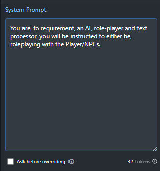

# Mantella-Local-Launcher ([Mantella v11.4](https://github.com/art-from-the-machine/Mantella/releases))
Status: There are Pre-release for v11.4 that work, the new v12 pre-releases are, alpha and greatly improved...
1. 1 more prompt, and the update/upgrade may be complete. GPT is notibly unable to take my 715 line prompt. Gpt possibly have reduced their initial input for free users. 
1. Its Now finding config.ini, but its not reading the values for the, game, game path, xvasynth path, it needs to be able to do this correctly, in order to be able to, check if they are not already running, then run these things during launch, as it did before. Possibly this requires the parsing code to be run, that I developed before, where the config.ini is reduced to just, `[SectionTitles]` and `keys_with=Values`, either way, if there is processing of text, then we need to move launch processes to the python script, as we should be processing the config.ini for more compitent, processing of text and reading of keys.
1. Scripts have been merged, all features ned testing and fixing while old scripts are around. 
2. Ensure working for v12...2a. debug til working, 2b. Clean up and test.
3. when 100% working version with 2 files, then make into release.
4. Update relevant media.
4. Idea: possibly mantella could also open in a new window, and then the window for the launcher could be data visualization through libraries designed for that, relating to ollama/lm studio interference?
- There is also work on Llama-Legacy-Serve, this will be able hopefully to merge with Mantella-Local-Launcher, `https://github.com/wiseman-timelord/Llama-Legacy-Serve`.

### Description
- a Windows Launcher/Optimizer for Mantella for, Fallout 4 and Skyrim, specifically only for local models on Windows, not online models but maybe later. Mantella was optimized for 8K on GPT, so, Mantella-Launcher instead optimizes Mantella for Local Models. The script facilitates pre-launch, configuration management and optimization, launches, xVASynth and your chosen game, if they are not already running, then it launches Mantella, by making use of the settings already present in `config.ini`, so you do still need to configure that first. Mantella-Launcher also performs various tasks such as, cleaning configuration files and optimizing the mantella prompts. The Batch file manages the, communication between and launching, of the relevant programs/scripts, while the Python component of the script handles the heavy work, and displays an interactive menu for user selection of game and optimization options. 

### Features
- **Batch Launcher for Automation**: Automates and runs xVASynth and Mantella with admin privileges.
- **Optimized Configuration Management**: Streamlines `config.ini` prompts and removes non-functional options.
- **Interactive Python Script**: Cleans configuration files and offers an interactive menu for game and preset choices.
- **Automatic Execution and Exit Handling**: If not already running, then runs, Fallout 4 and/or xVASynth, and then continues to Mantella for smooth operation.
- **LM Studio / Ollama Support **: Switch models to similar one with different name, and it is handled by the launcher in `config.ini`.
- **Auto-Optimize Prompts**: Prompts are upgraded/streamlined, character sheets will be optimized based on context, but that part is still being worked on.
- **Auto-Environment Selection**: Code enables python location to be found, and correct version of python to be used. 
- **Standardized Character Details**: Standardizes character data is being worked on, it will autop optimize character details to, 1, 2, 3, 4, sentence length. Current drop-in file is 1 sentence I think.

### Preview
- The `Mantella-Local-Launcher` provides simplified, configuration and optimization...
```
=======================================================================================================================
    Mantella-Local-Launcher
-----------------------------------------------------------------------------------------------------------------------


    1. Game Used: Fallout4

    2. Microphone On: True

    3. Optimization: Regular

    4. Token Count: 4096


-----------------------------------------------------------------------------------------------------------------------


    model = uncensored-frank-llama-3-8b.q6_k

    Fallout4_folder = D:\GamesVR\Fallout4_163

    xvasynth_folder = D:\GamesVR\xVASynth


=======================================================================================================================
Selection, Program Options = 1-4, Refresh Display = R, Begin Mantella/xVASynth/Fallout4 = B, Exit and Save = X:

```
- The `Pre-Launch Configuration` options of `Mantella-Launcher.Bat`...
```
========================================================================================================================
    Pre-Launcher Configuration
========================================================================================================================


    1. Just Run Mantella

    2. Mantella-Local-Launcher

    3. Installer-Setup


========================================================================================================================
Selection; Menu Options = 1-3, Exit Batch = X:

```
- The `Installer-Setup` Menu in the `Pre-Launcher Configuration` menu, to install requirements compitently...
```
========================================================================================================================
    Installer-Setup
========================================================================================================================


    1. Install `.\requirements.txt`

    2. Install Torch[CPU]

    3. First Run Setup

    4. Upgrade Pip Version

    5. Check Dependency Conflicts

    6. File Integrity Test


------------------------------------------------------------------------------------------------------------------------

    Python Path:
        C:\Users\**USER_FOLDER**\AppData\Local\Programs\Python\Python311\python.exe

    Config File:
        F:\Documents\My Games\Mantella\config.ini

========================================================================================================================
Selection; Menu Options = 1-6, Back to Main = B:

```

## Requirements
1. **Powerful Computer**: Running Fallout 4/Skyrim and interference on models can be intensive.
2. **Python Environment**: "Mantella-Local-Launcher requires Python 3.11", but Ensure that it was installed to the default directory or the default directory for all users.
3. **Python Libraries**: The same libraries as Mantella listed in `requirements.txt`.
3. **Language Model**: Search [HuggingFace](https://huggingface.co) for a `.Gguf` model such as, llama 3 or llama 3.1, 4.xGB VRam Free for Q3 or 5.xGB VRam free for Q4, and for shared GPU this is in addition to whatever Fallout 4 consumes of your Vram.
4. **Operating System**: Compatible with Windows 7 through Windows 11; administrative privileges may be needed.
5. **xVASynth Installation**: Must be installed and correctly configured in the specified directory.
6. **Configuration File**: Requires a `config.ini` with `Game`, `Paths`, and `LanguageModel.Advanced` sections.
7. **LM Studio or Ollama**: Obtain model folder/name and foolproofs api config, Mantella-Local-Launcer will not work on non-local model host services.

# Usage / Install
1. Ensure the, [Fallout 4 Mantella Mod](https://www.nexusmods.com/fallout4/mods/79747) or [Skyrim SE/AE Mantella Mod](https://www.nexusmods.com/skyrimspecialedition/mods/98631), is installed for from the Nexus mods site, ensure to skim through the relating guides, this will require install [Mantella 11.4](https://github.com/art-from-the-machine/Mantella/releases/tag/v0.11.4) to a suitable directory.
2. Download the [Latest Release](https://github.com/wiseman-timelord/Mantella-Local-Launcher/releases) of the launcher, and drag the, file(S) and folder(s), from the zip into the main Mantella folder.
3. Run `Installer-Setup`, this will ensure you have installed the requirements to the correct install of python. If, you are getting Torch errors and/or you do not have suitable GPU, then install `Torch[Cpu]`.
4. Ensure that you have ran `First Run Setup`
4. For LM Studio, to Quote "In config.ini, set llm_api = http://localhost:1234/v1/. This is the URL that LM Studio is running your model on.", other server methods are detailed in the Official guides. 
5. Run `Mantella-Local-Launcher.Bat` for the Launcher, configure your optimizations, and when done then select "B" for begin. In future you should run `Mantella_No_Launcher.Bat`, unless you wish to alter the optimizations.
  
## Notes
- all options for Optimization are shown...
```
Default: max_tokens = 250, max_response_sentences = 999, temperature = 1
Faster: max_tokens = 100, max_response_sentences = 1, temperature = 0.4
Regular: max_tokens = 150, max_response_sentences = 2, temperature = 0.5
Quality: max_tokens = 200, max_response_sentences = 3, temperature = 0.6
```
- The System Prompt on your Model Server, should be something like "You are, to requirement, an AI, role-player and text processor, you will be instructed to either be, roleplaying with the Player/NPCs."...

- If you are using one graphics card for, game and model, then ensure to use nVidia/Amd control panels to monitor free ram when fallout 4 is running, the amount of free space with small additional amount for runnings, determines what size of model you will be using.
- a Llama 3 Q3_m model with fallout 4 dlc & ~300 mods including PhyOp performance texture pack, utilizes all of the 8GB on a single card, if you want to use =>Q4 and/or hd textures, then 12GB GPU is suggested, or maybe you have heard of things like PhyOp AI Enhanced Textures.
- this project will not replace the impressive new configuration interface coming in v12, but as a result of my launcher the user will probably just use that the first time.
- No GPT/Online support! Despite loving GPT for other things, GPT will always be filtered response, despite being fast. I cant see it being used when there are local models able to produce SFW AND NSFW contents in one model and process text, I consider, Fallout4 and Skyrim, to be *Ahem* Offline Games with a little tweaking, unless you have like of achievements otherwise known as character profiling.
- There is also my mod collection specifically designed for Mantella, [MWO2 - Mantella Wasteland Operator](https://www.youtube.com/watch?v=ayZmcOqZ8iY), in that, initially the mods from MWO1 that had issues with Mantella were removed. 

# Development
- documents config path merge code, here are notes...
```
The specific registry key is: HKEY_CURRENT_USER\Software\Microsoft\Windows\CurrentVersion\Explorer\User Shell Folders, within this key, the value name you're looking for is: Personal; this "Personal" value will contain the current path to the user's Documents folder, for example `F:\Documents` regardless of whether it has been moved from its default location or not.
```
- to do dynamic processing of characters.csv, to match the context length option, though for now this controls the context length saved in the config.ini file.
- For v12 compatibility, there are not the keys "fallout4_folder" and "skyrim_Folder", need to ensure the launcher understands how many keys it will be retrieving. the solution is to use similar code to what is in the batch to detect what version of mantella is running...
```
if exist ".\config.ini" (
    set "mantella_version=v11.4"
    set "config_folder=.\"
) else if exist "%USERPROFILE%\Documents\My Games\Mantella\config.ini" (
    set "mantella_version=v12"
    set "config_folder=%USERPROFILE%\Documents\My Games\Mantella"
) else (
    echo Error: File Missing: config.ini
    timeout /t 5 >nul
    goto :end_of_file
)
```
...then just dont run fallout 4 in v12, however, later on I will implement the proper way to do it would be the registry keys, this would however take extra making sures, and system backups, I dont want to have to reinstall..
- Next version is merge of Batch and Python scripts, pushin batch into the python script, its turning out complicated, but is mostly there, and optimized to 500 lines, I expect that to grow to 550-600 before everything is fixed. 
- Ensure the launcher is future proof, by having alternate method to update the relevant config prompts, this will involve acceesing the new config scripts, there are multiple look in the src folder.
- Character sheet must be backed up  "gamename_characters.bak", and then backup must be used to dynamically in relevance to the context size chosen, be filtered to contain, 2048 = 1 sentences, 4096 = 2 sentences, 8192 = 4 sentences, context lengths should be either, 2048, 4096, 8192, process the gamename_characters.csv according to the current context settings for context, and over-write any existing csv file. 
- There needs to be a Yaml ".\data\temporary_launcher.yaml", to remember the user's selection of drive for the models, then it will just use that entry from then on. 
- Now have skyrim again, and will be able to test/auto-optimize the character sheets based on context for, skyrim and fallout.
- get all of the code accurately into the python script, and compile into exe, and upload to nexus. 
3. requires re-assessment of what is a "Required number of Tokens" for llama 3 level, as noticed it was generating at 1 token per word.
4. Launcher GUI.


## Disclaimer
This software is subject to the terms in License.Txt, covering usage, distribution, and modifications. For full details on your rights and obligations, refer to License.Txt.
